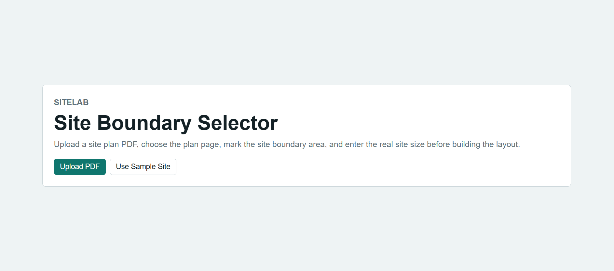
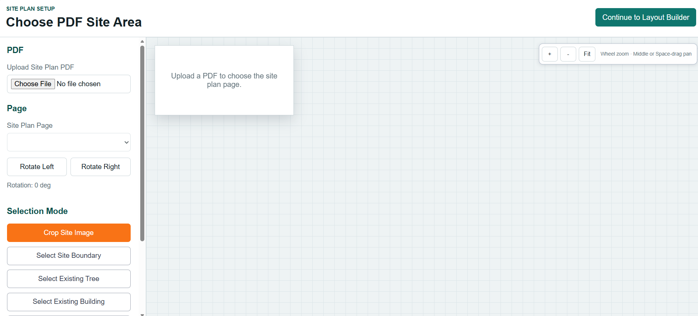
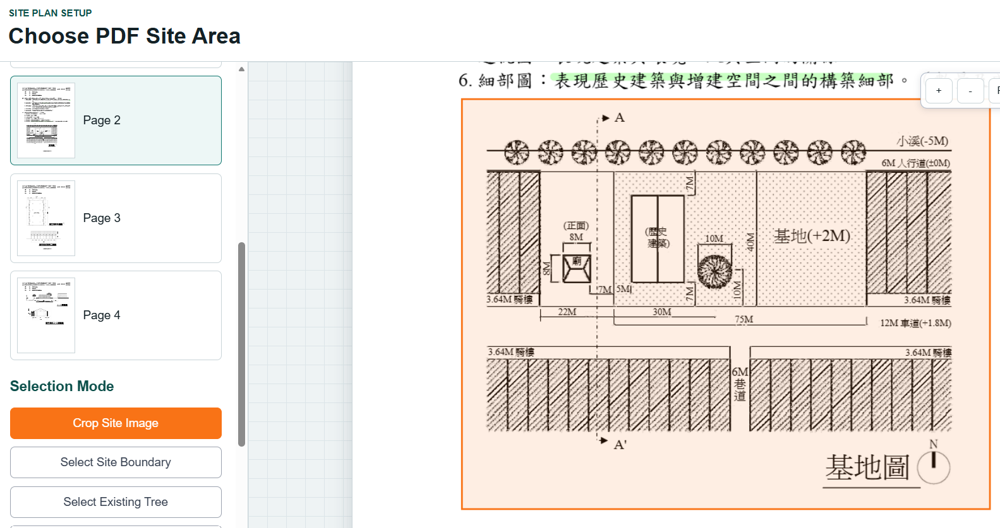
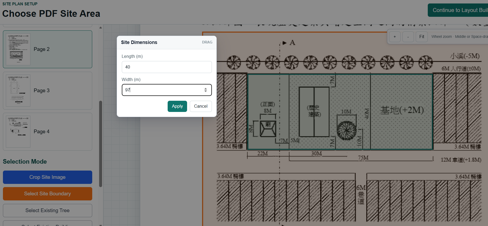
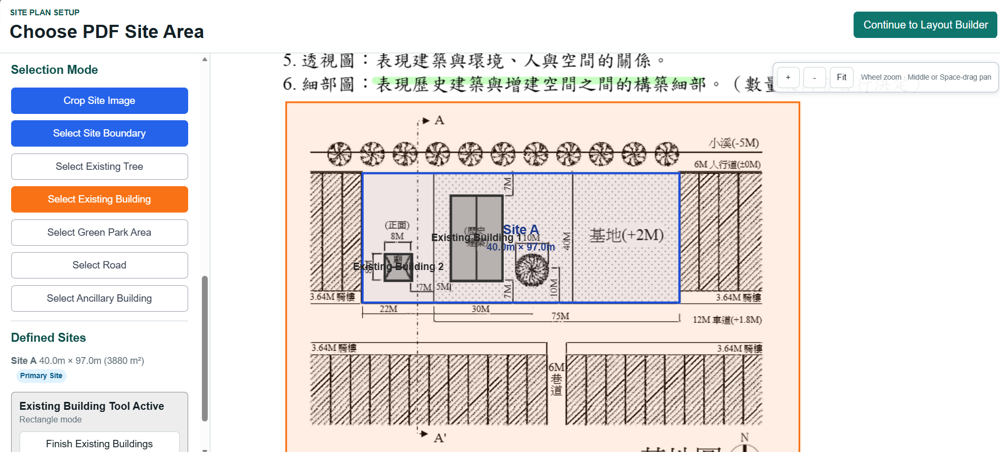
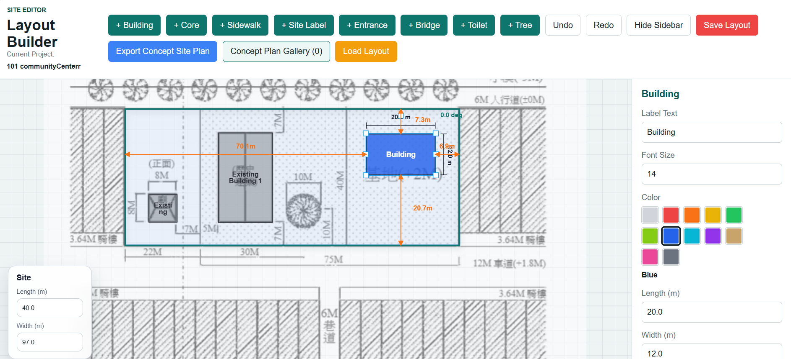
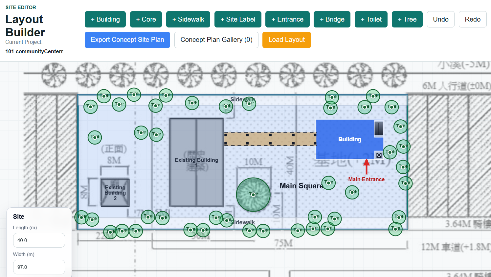
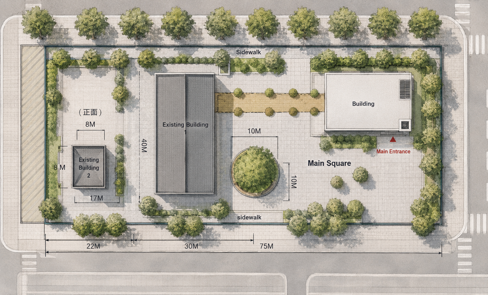

# SiteLab

Transform site plans into conceptual layouts.

  

## Overview

SiteLab is an interactive conceptual site planning tool for architects and architecture students.

Import a PDF site plan, define site conditions, explore multiple layout concepts, and export presentation-ready site plans—all in one workflow.

## 🛠 User Workflow

### 1. Upload Site Plan

Import a PDF site plan to start a new conceptual site planning project.

  

---

### 2. Crop Site

Crop the target site from the original architectural drawing.

  

---

### 3. Define Site Boundary

Define the site boundary using either rectangle or polygon mode.

  

---

### 4. Set Real-World Scale

Assign real-world dimensions to ensure accurate distance and area measurements.

  

---

### 5. Map Existing Conditions

Map existing buildings, trees, roads, green spaces, and other site elements.

  

---

### 6. Design Site Layout

Create, edit, and refine conceptual site layouts using interactive design tools.

  

  

---

### 7. Export Concept Site Plan

Export presentation-ready concept site plans for design reviews and presentations.

  

## ✨ Features

### Site Preparation

- Import PDF site plans
- Crop site drawings
- Define site boundaries
- Set real-world dimensions

### Existing Conditions

- Existing buildings
- Existing trees
- Roads
- Green spaces
- Ancillary buildings

### Concept Design

- Interactive layout editor
- Building placement
- Entrance tools
- Sidewalk creation
- Measurement tools
- Object rotation
- Undo / Redo

### Export

- Save layouts
- Export concept site plans

## ⚙️ Tech Stack

| Category | Stack |
|----------|-------|
| **Frontend** | React · TypeScript · Vite |
| **Canvas** | Konva · React-Konva |
| **PDF Processing** | PDF.js |
| **Version Control** | Git · GitHub |

## 💡 Why I Built SiteLab

As someone with an architecture background, I wanted to simplify the early-stage site planning process.

SiteLab was originally created to help Taiwanese architecture students rapidly explore multiple site planning solutions while preparing for the architectural licensing examination.

Although it began as an exam preparation tool, the workflow can also be used for conceptual architectural design and urban planning studies.

## 🚀 Future Improvements

- AI-assisted concept rendering
- Google Maps integration
- Cloud project storage
- Team collaboration
- Multi-site project support
